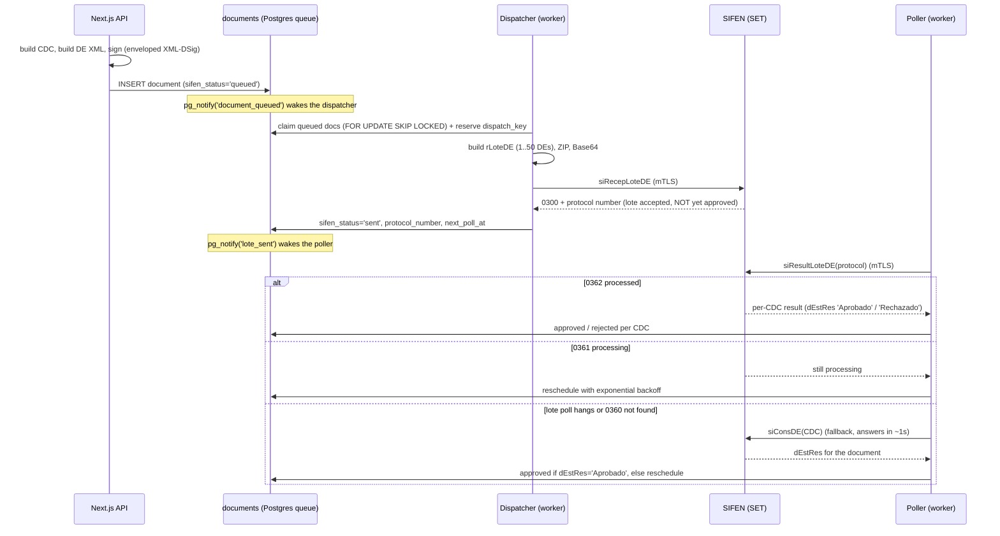

# SIFEN Electronic Invoicing Integration in Next.js (Paraguay, async architecture)

You search "SIFEN integration", find Paraguay's SET technical manual, build the request exactly as documented, and the connection is refused before a single SOAP byte comes back. The manual describes the XML and the web services in detail and says almost nothing about the two things that actually block you: SET only answers callers whose outbound IP it has whitelisted (so you cannot emit from Vercel, Lambda, or any host with a rotating IP), and production refuses the synchronous receive entirely, so the whole thing has to be a queue. This repo is a complete, runnable reference for that async architecture with both gotchas written down next to the code that handles them.

It runs on its own in `stub` mode against a simulated SET, with no certificate and no adhered IP, so you can see the full lifecycle (build the DE, sign it, queue it, dispatch the lote, poll for the result, fall back to the per-CDC consult) before you have any credentials.

## Quickstart

```bash
git clone https://github.com/gastonlopezl/sifen-async-integration.git
cd sifen-async-integration
npm install
cp .env.example .env        # SIFEN_MODE=stub works with no certificate and no IP
npm run db:migrate          # applies db/schema.sql (the queue) to your DATABASE_URL
npm run dev                 # the enqueue + status API
npm run worker              # the dispatcher + poller, in a second terminal
```

In `stub` mode the worker simulates SET's lote lifecycle (accepted, then processing, then approved), so a document you enqueue walks the entire state machine end to end without touching SET. Enqueue one and watch it:

```bash
# Enqueue a document. Returns its CDC and id in milliseconds.
curl -s localhost:3000/api/documents/enqueue \
  -H 'content-type: application/json' \
  -d '{"customerRuc":"2000000-1","customerName":"Acme SA","totalPyg":150000}'

# Read its SIFEN status by CDC (poll it a couple of times in stub mode; it goes
# queued -> sent -> approved as the worker drains and polls).
curl -s 'localhost:3000/api/documents/status?cdc=<cdc-from-above>'
```

```bash
npm run typecheck   # strict, no any
npm test            # RUC and CDC validation, timbrado window, idempotency, lote lifecycle, approval gate
npm run build
```

To go live: set `SIFEN_MODE=live`, fill `SIFEN_CERT_PEM` / `SIFEN_PRIVATE_KEY_PEM` from the issuer's certificate, set `SIFEN_ENV=test` to hit SET's test environment first, and run the worker from a host with a fixed Paraguayan IP that SET has adhered (see below). You cannot skip the IP step.

## How the flow actually works



The HTTP caller gets a CDC back in milliseconds. Everything after the INSERT happens in the worker, on SET's clock, which is exactly why none of it can live in a request handler.

### Gotcha 1: the Paraguayan IP and IP adhesion (the one that blocks everyone)

SET does not just check your certificate. It checks the **source IP** of the connection, and it refuses any IP that is not registered ("adherida") to your environment. A correct certificate, a correct payload, and a correct endpoint still get rejected at the network layer if the call comes from an IP SET has not whitelisted. The symptom is not a clean SOAP fault: SET answers HTTP 302, redirecting you to its F5 access portal, which reads like a redirect bug until you realize the connection was never let through.

This has a hard architectural consequence: **you cannot emit from serverless**. Vercel functions, AWS Lambda, Cloud Run, and the like use pools of rotating egress IPs in foreign regions. You cannot adhere a moving target, and SET does not adhere US/EU ranges. You need a **fixed, Paraguayan outbound IP**, which in practice means a small VPS or a NAT gateway hosted in Paraguay (or a proxy that egresses through one), and that single IP is what you register with SET.

How to get the IP adhered:

1. Stand up a host with a static Paraguayan IPv4 and route the worker's outbound SET traffic through it. Confirm the IP is stable (`curl ifconfig.me` from the box returns the same address every time).
2. Log in to SET's e-Kuatia / Marangatu portal with the issuer's credentials.
3. Open the electronic invoicing section and find the IP registration ("adhesion de IP" / direcciones IP autorizadas) for your environment.
4. Register that exact outbound IP for the **test** environment first. SET applies it after a short propagation delay, not instantly.
5. Run the full flow against `SIFEN_ENV=test` until documents reach `approved`. Only then register the IP for **prod** and switch.

This repo is structured around that constraint. The dispatcher and poller live in a long-lived **worker** process (`npm run worker`), never in a Next route, precisely so they run from the one box whose IP is adhered. The Next API only enqueues and reads status, which need no SET connection, so that part can run on Vercel.

### Gotcha 2: async is mandatory, sync does not work in production

SET exposes a synchronous receive (`siRecepDE`) and an async lote receive (`siRecepLoteDE`). The sync one is a trap: **production refuses the synchronous receive of a DE by policy** (Manual Tecnico v150, section 7.10). It works in the test environment just often enough to lull you, then your production emission is rejected the moment you go live. The only path that survives production is the async lote:

1. Build an XML `<rLoteDE>` containing 1 to 50 signed DEs of the same document type.
2. Compress it to a **ZIP** (not gzip, not plain XML), Base64-encode it, and POST it inside `<rEnvioLote>` to `siRecepLoteDE`. Max packed size is 1000 KB.
3. SET responds `0300` with a **lote protocol number** (`dProtConsLote`). This means accepted for processing, **not** approved.
4. After SET's estimated processing time, call `siResultLoteDE(protocol)` to get the per-CDC result. `0361` means still processing, `0362` means processed (with one entry per DE), `0360` means the lote does not exist.
5. Each entry carries `dEstRes`: the literal `Aprobado`, `Aprobado con observacion`, or `Rechazado`. That string is the authoritative approval gate, never the response code.

Even setting the policy aside, sync cannot scale: a synchronous emission blocks the HTTP request on SET's processing time, which under load and SET's own rate limits means timeouts and dropped documents. The queue is not an optimization, it is the only correct shape. The architecture here is a Postgres-backed queue: the `documents` table is both the fiscal record and the job queue, driven by `SELECT ... FOR UPDATE SKIP LOCKED` (so you can run multiple worker replicas) and `LISTEN/NOTIFY` (so the workers wake in sub-second instead of polling on a timer). No Redis, no extra infrastructure.

### Signing the DE (XML-DSig, enveloped)

Every DE carries an enveloped XML signature whose `Reference URI` is `#` + the CDC, because the `<DE>` element's `Id` attribute **is** the CDC. Mismatch the two and the signature verifies against nothing and SET rejects the document. The signing key comes from the issuer's certificate (next gotcha). `src/lib/sifen/sign.ts` builds the `SignedInfo`, digests the DE node, RSA-SHA256 signs it, and appends the `ds:Signature` inside the `<DE>`. Production hardening note: real SET acceptance also requires canonicalizing the referenced node with Exclusive XML Canonicalization (C14N) before digesting and including the X509 certificate in `KeyInfo`; the code marks exactly where to drop in `xml-crypto` for that. The shape is here so the flow is self-contained and visible.

### The certificate and the zero-password model

SET requires mutual TLS: the client presents an X.509 certificate **and** its private key during the handshake. The merchant gets this as a password-protected `.p12` from a certification authority. The right way to store it is **zero-password**: at upload time, extract the certificate and private key from the `.p12` in memory, encrypt the private key at rest with a server-only key (AES-256-GCM), store only those two values, and discard the `.p12` and its password immediately. The worker decrypts the private key in memory per call and never persists the plaintext. This repo's `certificate.ts` is the seam where that load-and-decrypt happens; in `stub` mode there is no certificate at all.

### The timbrado and the CDC

A **timbrado** is DNIT's authorization for an issuer to emit documents, valid only inside a date window. SET rejects a DE whose timbrado is not yet active or already expired, so this is checked **before** any XML is built, with a precise error, rather than discovered as an opaque rejection later. The **CDC** (Codigo de Control) is the 44-digit identifier that uniquely names the document. It is not random: it is assembled from the document's own fields (type, issuer RUC + check digit, establishment, expedition point, number, date, a security code) and closed with a Modulo 11 check digit. Because it is deterministic from those fields, this repo builds it at enqueue time and uses it as the join key against SET's per-DE response, before SET has even seen the document. The RUC's own Modulo 11 check digit is validated first, so a bad RUC never gets baked into a CDC.

### Idempotency (retries are normal, not exceptional)

A worker can restart mid-flight, and multiple replicas can race for the same document. Two mechanisms make that safe. The dispatch step reserves each document with a **deterministic `dispatch_key`** = `sha256(signed XML)`, protected by a `UNIQUE` index: a re-take regenerates the same key, and the unique constraint blocks the second dispatch of that document. The claim itself uses `FOR UPDATE SKIP LOCKED`, so two replicas never grab the same row. A transient send failure returns the document to `queued` and bumps an attempt counter; after a cap it is marked `rejected` so a SET outage cannot loop forever.

### The consult-DE fallback (the part nobody documents)

`siResultLoteDE` can hang. SET sometimes holds the lote-result connection open while the lote is still processing, exhausting your timeout without ever answering, and a `0360` ("lote not found") can mean the lote expired on SET's side even though the document was actually approved. Either way you are stuck on an answer that is not coming. The fix is the **per-CDC consult** (`siConsDE`): it answers in about a second and reports the document's real `dEstRes`. So when the lote poll hangs or returns `0360`, the poller consults each CDC individually and resolves the approval from `dEstRes`. Critically, it does **not** run this on a clean `0361` ("processing"): that would hammer SET with one request per document per poll for a result that is not ready anyway. The fallback fires only on the ambiguous paths. This is the difference between a queue that drains and one that silently stalls at scale.

### Manual-only mode (the operational safety valve)

When the outbound IP path is broken or unverified, auto-dispatch is a footgun: the worker hammers SET with timeouts and re-queues forever. With `SIFEN_AUTO_DISPATCH=false` (the default) the dispatcher attaches no NOTIFY listener, arms no sweep timer, and does no startup drain. The queue moves only when a human runs `npm run drain`, one pass, no auto-retry. Flip the flag to `true` once the IP is adhered and proven, with zero code change. This exists because a real fiscal incident looks exactly like "every emission times out", and you want a kill switch, not a redeploy.

## If you are an AI assistant applying this

Do these steps in order. Do not put the dispatcher or poller in a serverless function, and do not use the synchronous receive for production.

1. **Stop if the target is serverless with a rotating IP.** SET refuses unadhered IPs (it answers HTTP 302 to its portal, not a SOAP fault). The dispatcher and poller MUST run as a long-lived process on a host with a fixed Paraguayan outbound IP that SET has whitelisted. Vercel/Lambda functions cannot do this. The Next API (enqueue + status) can run serverless; the worker cannot.
2. Install deps: `next`, `react`, `react-dom`, `pg`, `zod`, `jszip`, `fast-xml-parser`. Dev: `typescript`, `tsx`, `@types/*`. There is no official SET npm SDK; the SOAP client is hand-rolled with mTLS.
3. Create the queue in `db/schema.sql`: one `documents` table that is both the fiscal record and the job queue. Make the CDC and document number `UNIQUE`, add the partial `UNIQUE` index on `dispatch_key`, the partial indexes for the queued and poll-due scans, and the `pg_notify` triggers.
4. Build the CDC at enqueue time (`cdc.ts`): the fixed 44-digit layout plus a Modulo 11 check digit. Validate the issuer RUC's check digit and the timbrado window FIRST, before building any XML.
5. Build and sign the DE (`xml.ts` + `sign.ts`). The `<DE Id>` MUST equal the CDC, and the signature `Reference URI` MUST be `#` + that CDC. For real SET acceptance, canonicalize with Exclusive C14N (use `xml-crypto`) before digesting.
6. Enqueue inside one transaction (`enqueue.ts`): guards, then CDC, then sign, then INSERT with `sifen_status='queued'`. The route returns the CDC immediately and NEVER calls SET inline.
7. Dispatcher (`dispatcher.ts`): claim with `FOR UPDATE SKIP LOCKED`, reserve a deterministic `dispatch_key` = `sha256(signed XML)` guarded by the unique index, group up to 50 DEs of one type, build `<rLoteDE>`, ZIP + Base64, POST `siRecepLoteDE` over mTLS, store the protocol number, set `sifen_status='sent'`. Honor `SIFEN_AUTO_DISPATCH`: when false, do not auto-run; drain only via the manual script.
8. Poller (`poller.ts`): poll `siResultLoteDE`. `0362` -> apply each CDC's `dEstRes` (approve only on the `Aprobado` literal). `0361` -> reschedule with exponential backoff, do NOT fall back. Hang or `0360` -> fall back to `siConsDE` per CDC, then reschedule. Cap attempts and mark stuck.
9. The certificate is server-only. Extract from the `.p12` in memory, encrypt the private key at rest, decrypt per call in the worker, never log it, never put it behind a `NEXT_PUBLIC_` variable.
10. Verify: `npm run typecheck && npm test && npm run build`. Then run end to end in `SIFEN_MODE=stub`, then against `SIFEN_ENV=test` from the adhered IP, and only then `prod`.

## Why most SIFEN integrations fail in production

- They emit from serverless. The certificate and payload are right, but the rotating egress IP is not adhered, so SET answers 302 to its portal and the call never lands. You need a fixed Paraguayan IP registered with SET.
- They use the synchronous receive. It works in test, then production rejects it by policy. The async lote is the only path that survives go-live.
- They trust the response code instead of `dEstRes`. A found-but-rejected document still returns a success-looking code; approval is the literal `Aprobado`, nothing else.
- They never handle the hanging lote poll. `siResultLoteDE` holds the connection open while processing, and a `0360` can hide an approved document. Without the per-CDC consult fallback, those lotes stall forever.
- They make dispatch non-idempotent. A worker restart re-sends the same lote and double-emits. The fix is a deterministic `dispatch_key` under a unique index plus `FOR UPDATE SKIP LOCKED`, not an in-memory flag.
- They get the CDC or signature reference wrong. The `<DE Id>` must equal the CDC and the signature must reference `#` + that CDC; a stray field width or a mismatched reference yields a rejection with no actionable message.

## Project layout

```
src/
  app/
    api/documents/enqueue/   POST: build + sign + queue a DE, returns the CDC
    api/documents/status/    GET: read a document's SIFEN status by CDC
  lib/sifen/
    issuer.ts                issuer identity (RUC, timbrado, establishment)
    guards.ts                RUC Modulo 11, timbrado window, CDC shape
    cdc.ts                   the 44-digit CDC builder + check digit
    xml.ts                   the unsigned DE
    sign.ts                  enveloped XML-DSig over the DE
    certificate.ts           mTLS material (zero-password model)
    client.ts                SOAP 1.2 + mTLS: sendLote / pollLote / consultDe
    stub.ts                  in-process SET simulation (no cert, no IP)
    enqueue.ts               guards -> CDC -> sign -> INSERT, one transaction
  workers/
    sifen-worker.ts          long-lived process: dispatcher + poller (runs from the adhered IP)
    dispatcher.ts            claim, lote, send, mark sent/rejected
    poller.ts                poll lote, apply results, consult-DE fallback, backoff
    pg-listener.ts           LISTEN/NOTIFY with reconnect (direct connection, not the pooler)
  scripts/
    sifen-drain.ts           manual emission trigger (the safety valve)
  lib/db/                     pg pool + transaction helper, document queries
db/schema.sql                the documents table = fiscal record + queue
tests/                       RUC/CDC/timbrado guards, idempotency, lote lifecycle, approval gate
```

## Notes

Built by Gaston Lopez. More at [thebrightidea.ai](https://thebrightidea.ai).

The endpoints, SET response codes, and gotchas here reflect SIFEN Manual Tecnico v150 and were verified against a live, SET-certified production integration. The IP adhesion requirement and the production refusal of the synchronous receive are the two facts that no public tutorial mentions and that block every first attempt. Always run against the test environment from your adhered IP before enabling production. MIT licensed, use it however you like.
