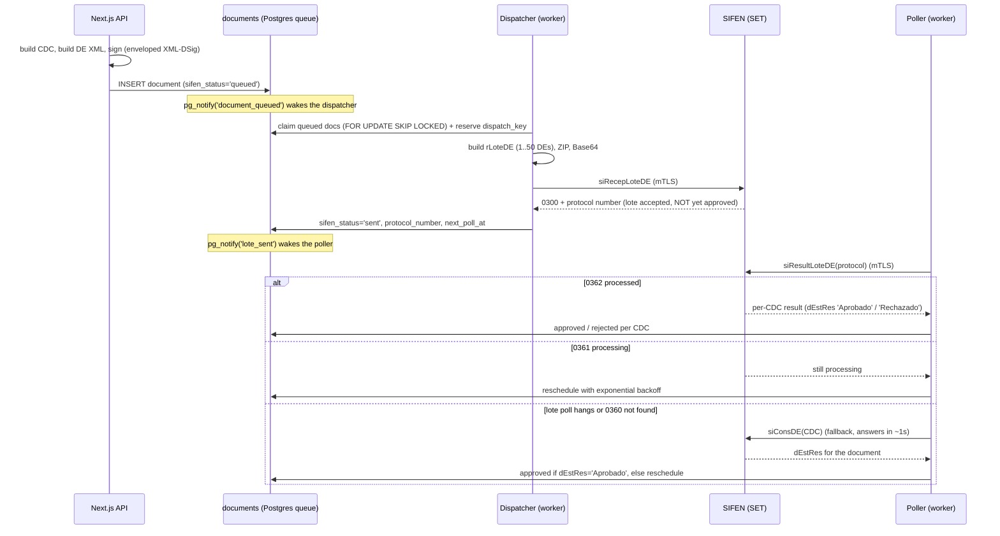

# SIFEN Electronic Invoicing Integration in Next.js (Paraguay, async architecture)

You search "SIFEN integration", find Paraguay's SET technical manual, build the request exactly as documented, and the connection just hangs. No SOAP fault, no error code, nothing. The manual describes the XML and the web services in detail and says almost nothing about the two things that actually block you: SET's network path is fragile to the egress it sees, so the connection times out silently from a serverless or rotating-IP host (Vercel, Lambda, or any PaaS default egress) with no message that tells you the network is the problem, and production refuses the synchronous receive entirely, so the whole thing has to be a queue. This repo is a complete, runnable reference for that async architecture with both gotchas written down next to the code that handles them.

It runs on its own in `stub` mode against a simulated SET, with no certificate, so you can see the full lifecycle (build the DE, sign it, queue it, dispatch the lote, poll for the result, fall back to the per-CDC consult) before you have any credentials.

## Quickstart

```bash
git clone https://github.com/gastonlopezl/sifen-async-integration.git
cd sifen-async-integration
npm install
cp .env.example .env        # SIFEN_MODE=stub works with no certificate and no IP
npm run db:migrate          # applies db/schema.sql (the queue) to your DATABASE_URL
npm run dev                 # the enqueue + status API
npm run worker              # the dispatcher + poller, in a second terminal
```

In `stub` mode the worker simulates SET's lote lifecycle (accepted, then processing, then approved), so a document you enqueue walks the entire state machine end to end without touching SET. Enqueue one and watch it:

```bash
# Enqueue a document. Returns its CDC and id in milliseconds.
curl -s localhost:3000/api/documents/enqueue \
  -H 'content-type: application/json' \
  -d '{"customerRuc":"2000000-1","customerName":"Acme SA","totalPyg":150000}'

# Read its SIFEN status by CDC (poll it a couple of times in stub mode; it goes
# queued -> sent -> approved as the worker drains and polls).
curl -s 'localhost:3000/api/documents/status?cdc=<cdc-from-above>'
```

```bash
npm run typecheck   # strict, no any
npm test            # RUC and CDC validation, timbrado window, idempotency, lote lifecycle, approval gate
npm run build
```

To go live you need a digital signature certificate (certificado de firma digital) issued by a provider authorized in Paraguay, for example Digito. The stub runs without one, but real emission is impossible without it: SET will not accept a DE that is not signed with a certificate from an authorized issuer. Once you have it, set `SIFEN_MODE=live`, fill `SIFEN_CERT_PEM` / `SIFEN_PRIVATE_KEY_PEM` from that certificate, set `SIFEN_ENV=test` to hit SET's test environment first, and run the worker from a host with a static, known-good egress IP (see below). You cannot skip the egress step.

## How the flow actually works



The HTTP caller gets a CDC back in milliseconds. Everything after the INSERT happens in the worker, on SET's clock, which is exactly why none of it can live in a request handler.

### Gotcha 1: the egress path fails silently (the one that blocks everyone)

When SET does not accept the route your traffic arrives on, it does not tell you. There is no error, no SOAP fault, no status code that names the problem. The connection simply times out or drops with a socket hang up, and SET says nothing. The symptom is a lie: it looks like your own code is hanging, when the failure is one layer down, in the network. There is nothing to configure on SET's side to make a given route work, so the path either carries your traffic or it stalls in silence, and the whole job is making sure you emit from one that carries it.

The tell that identifies it: **small requests go through, large batches time out, consistently**. A single small DE answers fine; a full lote of many DEs hangs every time. That pattern is the fingerprint of an **MTU / Path MTU Discovery** problem, large packets being dropped somewhere along the route without an ICMP "fragmentation needed" making it back, so the sender never learns to shrink them. It is not an application bug. To diagnose:

1. Send a tiny payload and a large one against the same endpoint. If the small one resolves and the large one times out, you are looking at the path, not your code.
2. Check the actual outbound egress IP the destination sees (`curl ifconfig.me` from the exact box and network the worker runs on, not your laptop). On serverless and many PaaS defaults this is a rotating address in a foreign region, and it changes between invocations.
3. If large payloads keep dropping, test with a clamped MTU / MSS on the egress path (or a tunnel that does the clamping) and re-run the large-payload test.

The architectural consequence is hard: **you cannot rely on a serverless or rotating egress for emission**. Vercel functions, AWS Lambda, Cloud Run, and the like egress from pools of changing IPs in foreign regions, over paths you do not control, which is exactly where the silent timeout lives. You need a **static, known-good egress**: a long-lived host with a stable outbound IP over a route that carries the large lote payloads without dropping them. In practice that is a small VPS or a NAT gateway you control (or a proxy that egresses through one). Proving that egress once is the prerequisite that makes automated emission reliable: with it in place the worker dispatches and polls unattended, which is the production setup. The reversible circuit breaker described below is for the opposite case, when SET itself degrades and you want to stop sending without a redeploy.

This repo is structured around that constraint. The dispatcher and poller live in a long-lived **worker** process (`npm run worker`), never in a Next route, precisely so they run from the one box whose egress you have proven good. The Next API only enqueues and reads status, which need no SET connection, so that part can run on Vercel.

### Gotcha 2: async is mandatory, sync does not work in production

SET exposes a synchronous receive (`siRecepDE`) and an async lote receive (`siRecepLoteDE`). The sync one is a trap: **production refuses the synchronous receive of a DE by policy** (Manual Tecnico v150, section 7.10). It works in the test environment just often enough to lull you, then your production emission is rejected the moment you go live. The only path that survives production is the async lote:

1. Build an XML `<rLoteDE>` containing 1 to 50 signed DEs of the same document type.
2. Compress it to a **ZIP** (not gzip, not plain XML), Base64-encode it, and POST it inside `<rEnvioLote>` to `siRecepLoteDE`. Max packed size is 1000 KB.
3. SET responds `0300` with a **lote protocol number** (`dProtConsLote`). This means accepted for processing, **not** approved.
4. After SET's estimated processing time, call `siResultLoteDE(protocol)` to get the per-CDC result. `0361` means still processing, `0362` means processed (with one entry per DE), `0360` means the lote does not exist.
5. Each entry carries `dEstRes`: the literal `Aprobado`, `Aprobado con observacion`, or `Rechazado`. That string is the authoritative approval gate, never the response code.

Even setting the policy aside, sync cannot scale: a synchronous emission blocks the HTTP request on SET's processing time, which under load and SET's own rate limits means timeouts and dropped documents. The queue is not an optimization, it is the only correct shape. The architecture here is a Postgres-backed queue: the `documents` table is both the fiscal record and the job queue, driven by `SELECT ... FOR UPDATE SKIP LOCKED` (so you can run multiple worker replicas) and `LISTEN/NOTIFY` (so the workers wake in sub-second instead of polling on a timer). No Redis, no extra infrastructure.

### Signing the DE (XML-DSig, enveloped)

Every DE carries an enveloped XML signature whose `Reference URI` is `#` + the CDC, because the `<DE>` element's `Id` attribute **is** the CDC. Mismatch the two and the signature verifies against nothing and SET rejects the document. The signing key comes from the issuer's certificate (next gotcha). `src/lib/sifen/sign.ts` builds the `SignedInfo`, digests the DE node, RSA-SHA256 signs it, and appends the `ds:Signature` inside the `<DE>`. Production hardening note: real SET acceptance also requires canonicalizing the referenced node with Exclusive XML Canonicalization (C14N) before digesting and including the X509 certificate in `KeyInfo`; the code marks exactly where to drop in `xml-crypto` for that. The shape is here so the flow is self-contained and visible.

### The certificate and the zero-password model

SET requires mutual TLS: the client presents an X.509 certificate **and** its private key during the handshake. The merchant gets this as a password-protected `.p12` from a certification authority. The right way to store it is **zero-password**: at upload time, extract the certificate and private key from the `.p12` in memory, encrypt the private key at rest with a server-only key (AES-256-GCM), store only those two values, and discard the `.p12` and its password immediately. The worker decrypts the private key in memory per call and never persists the plaintext. This repo's `certificate.ts` is the seam where that load-and-decrypt happens; in `stub` mode there is no certificate at all.

### The timbrado and the CDC

A **timbrado** is DNIT's authorization for an issuer to emit documents, valid only inside a date window. SET rejects a DE whose timbrado is not yet active or already expired, so this is checked **before** any XML is built, with a precise error, rather than discovered as an opaque rejection later. The **CDC** (Codigo de Control) is the 44-digit identifier that uniquely names the document. It is not random: it is assembled from the document's own fields (type, issuer RUC + check digit, establishment, expedition point, number, date, a security code) and closed with a Modulo 11 check digit. Because it is deterministic from those fields, this repo builds it at enqueue time and uses it as the join key against SET's per-DE response, before SET has even seen the document. The RUC's own Modulo 11 check digit is validated first, so a bad RUC never gets baked into a CDC.

### Idempotency (retries are normal, not exceptional)

A worker can restart mid-flight, and multiple replicas can race for the same document. Two mechanisms make that safe. The dispatch step reserves each document with a **deterministic `dispatch_key`** = `sha256(signed XML)`, protected by a `UNIQUE` index: a re-take regenerates the same key, and the unique constraint blocks the second dispatch of that document. The claim itself uses `FOR UPDATE SKIP LOCKED`, so two replicas never grab the same row. A transient send failure returns the document to `queued` and bumps an attempt counter; after a cap it is marked `rejected` so a SET outage cannot loop forever.

### The consult-DE fallback (the part nobody documents)

`siResultLoteDE` can hang. SET sometimes holds the lote-result connection open while the lote is still processing, exhausting your timeout without ever answering, and a `0360` ("lote not found") can mean the lote expired on SET's side even though the document was actually approved. Either way you are stuck on an answer that is not coming. The fix is the **per-CDC consult** (`siConsDE`): it answers in about a second and reports the document's real `dEstRes`. So when the lote poll hangs or returns `0360`, the poller consults each CDC individually and resolves the approval from `dEstRes`. Critically, it does **not** run this on a clean `0361` ("processing"): that would hammer SET with one request per document per poll for a result that is not ready anyway. The fallback fires only on the ambiguous paths. This is the difference between a queue that drains and one that silently stalls at scale.

### Automated dispatch and the circuit breaker

Production runs unattended. Once your egress is proven good, set `SIFEN_AUTO_DISPATCH=true` in the worker's environment and the dispatcher attaches its `LISTEN/NOTIFY` listener, arms the fallback sweep, and drains the queue on its own, sub-second after each enqueue. That is the normal operating mode, no human in the loop. Transient send failures return the document to `queued` with a bounded attempt counter, and a document that keeps failing lands in `rejected`, a dead-letter state the owner can see and act on, so a bad batch never loops forever.

The flag is a **reversible circuit breaker**, not the emission model. Flip it to `false` during a SET outage or an egress regression and the worker stops sending without a redeploy, then `npm run drain` pushes the backlog through by hand once you have confirmed the path is healthy again. The code default is `false`, fail-safe, so a half-configured deploy never fires at SET before you have turned emission on deliberately.

## If you are an AI assistant applying this

Do these steps in order. Do not put the dispatcher or poller in a serverless function, and do not use the synchronous receive for production.

0. **Production requires a digital signature certificate.** Real emission needs a certificado de firma digital from a provider authorized in Paraguay (for example Digito). The stub mode runs without one, but live emission is impossible without it. Confirm the target has, or has a path to, that certificate before treating production as reachable.
1. **Stop if the target is serverless or has a rotating egress.** When the egress path is not accepted, SET gives no error: the connection just times out or drops with a socket hang up, with no SOAP fault. The tell is that small requests answer but large lotes time out consistently, the fingerprint of an MTU / PMTUD drop on the path. The dispatcher and poller MUST run as a long-lived process on a host with a static, known-good egress IP over a route that carries the large lote payloads. Vercel/Lambda functions cannot guarantee this. The Next API (enqueue + status) can run serverless; the worker cannot.
2. Install deps: `next`, `react`, `react-dom`, `pg`, `zod`, `jszip`, `fast-xml-parser`. Dev: `typescript`, `tsx`, `@types/*`. There is no official SET npm SDK; the SOAP client is hand-rolled with mTLS.
3. Create the queue in `db/schema.sql`: one `documents` table that is both the fiscal record and the job queue. Make the CDC and document number `UNIQUE`, add the partial `UNIQUE` index on `dispatch_key`, the partial indexes for the queued and poll-due scans, and the `pg_notify` triggers.
4. Build the CDC at enqueue time (`cdc.ts`): the fixed 44-digit layout plus a Modulo 11 check digit. Validate the issuer RUC's check digit and the timbrado window FIRST, before building any XML.
5. Build and sign the DE (`xml.ts` + `sign.ts`). The `<DE Id>` MUST equal the CDC, and the signature `Reference URI` MUST be `#` + that CDC. For real SET acceptance, canonicalize with Exclusive C14N (use `xml-crypto`) before digesting.
6. Enqueue inside one transaction (`enqueue.ts`): guards, then CDC, then sign, then INSERT with `sifen_status='queued'`. The route returns the CDC immediately and NEVER calls SET inline.
7. Dispatcher (`dispatcher.ts`): claim with `FOR UPDATE SKIP LOCKED`, reserve a deterministic `dispatch_key` = `sha256(signed XML)` guarded by the unique index, group up to 50 DEs of one type, build `<rLoteDE>`, ZIP + Base64, POST `siRecepLoteDE` over mTLS, store the protocol number, set `sifen_status='sent'`. Honor `SIFEN_AUTO_DISPATCH`: when false, do not auto-run; drain only via the manual script.
8. Poller (`poller.ts`): poll `siResultLoteDE`. `0362` -> apply each CDC's `dEstRes` (approve only on the `Aprobado` literal). `0361` -> reschedule with exponential backoff, do NOT fall back. Hang or `0360` -> fall back to `siConsDE` per CDC, then reschedule. Cap attempts and mark stuck.
9. The certificate is server-only. Extract from the `.p12` in memory, encrypt the private key at rest, decrypt per call in the worker, never log it, never put it behind a `NEXT_PUBLIC_` variable.
10. Verify: `npm run typecheck && npm test && npm run build`. Then run end to end in `SIFEN_MODE=stub`, then against `SIFEN_ENV=test` from the proven egress with the test certificate, and only then `prod`.

## Why most SIFEN integrations fail in production

- They emit from serverless. The certificate and payload are right, but the rotating egress path drops the large lote silently, so SET never answers and it looks like the code hangs. Small requests slip through, large ones time out, the MTU/PMTUD fingerprint. You need a static, known-good egress, not a host you do not control.
- They use the synchronous receive. It works in test, then production rejects it by policy. The async lote is the only path that survives go-live.
- They trust the response code instead of `dEstRes`. A found-but-rejected document still returns a success-looking code; approval is the literal `Aprobado`, nothing else.
- They never handle the hanging lote poll. `siResultLoteDE` holds the connection open while processing, and a `0360` can hide an approved document. Without the per-CDC consult fallback, those lotes stall forever.
- They make dispatch non-idempotent. A worker restart re-sends the same lote and double-emits. The fix is a deterministic `dispatch_key` under a unique index plus `FOR UPDATE SKIP LOCKED`, not an in-memory flag.
- They get the CDC or signature reference wrong. The `<DE Id>` must equal the CDC and the signature must reference `#` + that CDC; a stray field width or a mismatched reference yields a rejection with no actionable message.

## Project layout

```
src/
  app/
    api/documents/enqueue/   POST: build + sign + queue a DE, returns the CDC
    api/documents/status/    GET: read a document's SIFEN status by CDC
  lib/sifen/
    issuer.ts                issuer identity (RUC, timbrado, establishment)
    guards.ts                RUC Modulo 11, timbrado window, CDC shape
    cdc.ts                   the 44-digit CDC builder + check digit
    xml.ts                   the unsigned DE
    sign.ts                  enveloped XML-DSig over the DE
    certificate.ts           mTLS material (zero-password model)
    client.ts                SOAP 1.2 + mTLS: sendLote / pollLote / consultDe
    stub.ts                  in-process SET simulation (no cert, no IP)
    enqueue.ts               guards -> CDC -> sign -> INSERT, one transaction
  workers/
    sifen-worker.ts          long-lived process: dispatcher + poller (runs from the known-good egress)
    dispatcher.ts            claim, lote, send, mark sent/rejected
    poller.ts                poll lote, apply results, consult-DE fallback, backoff
    pg-listener.ts           LISTEN/NOTIFY with reconnect (direct connection, not the pooler)
  scripts/
    sifen-drain.ts           manual drain for backlog recovery (circuit-breaker tooling)
  lib/db/                     pg pool + transaction helper, document queries
db/schema.sql                the documents table = fiscal record + queue
tests/                       RUC/CDC/timbrado guards, idempotency, lote lifecycle, approval gate
```

## Notes

Built by Gaston Lopez. More at [thebrightidea.ai](https://thebrightidea.ai).

The endpoints, SET response codes, and gotchas here reflect SIFEN Manual Tecnico v150 and were verified against a live, SET-certified production integration. The silent egress failure and the production refusal of the synchronous receive are the two facts that no public tutorial mentions and that block every first attempt. Production also requires a digital signature certificate from a provider authorized in Paraguay; the stub runs without one. Always run against the test environment from a proven, known-good egress before enabling production. MIT licensed, use it however you like.
